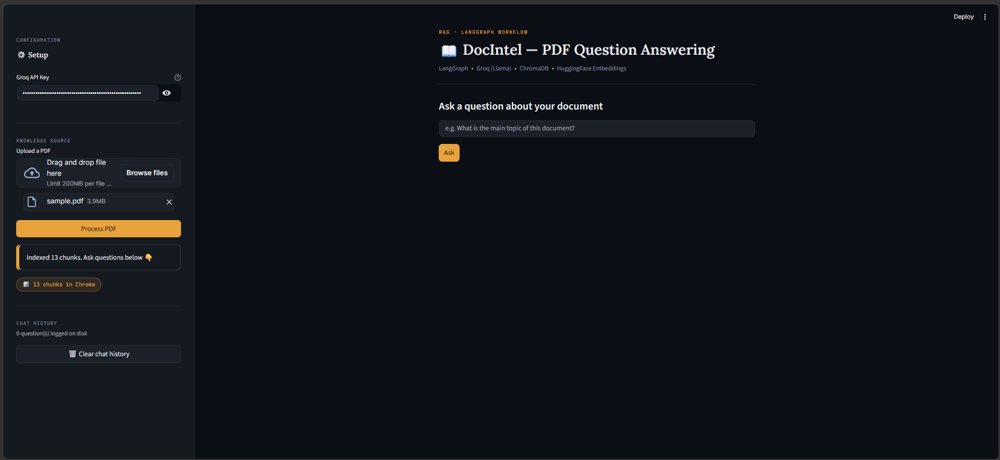
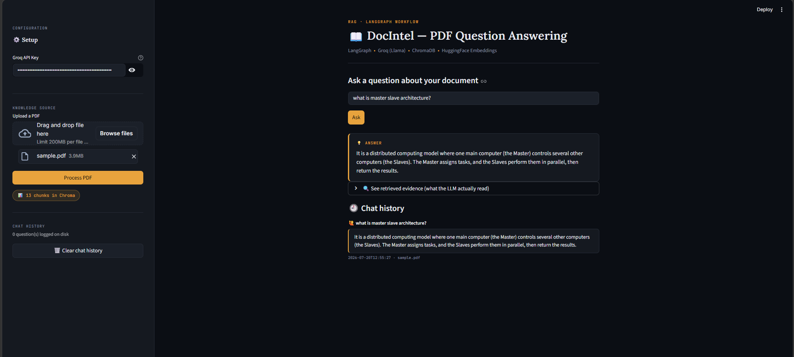
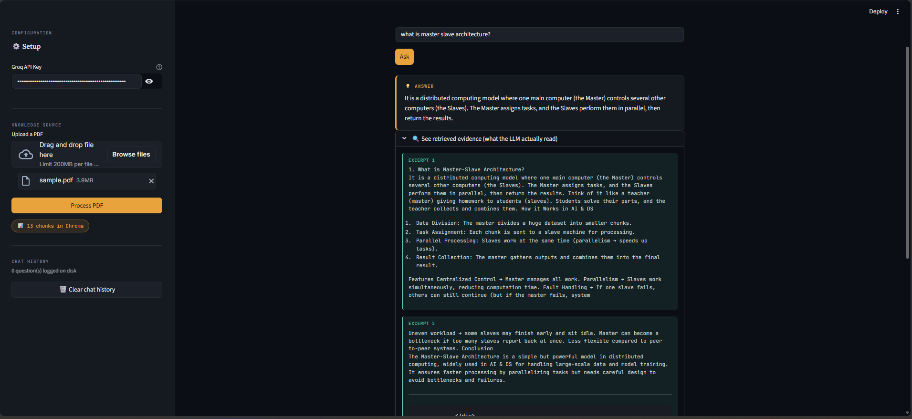
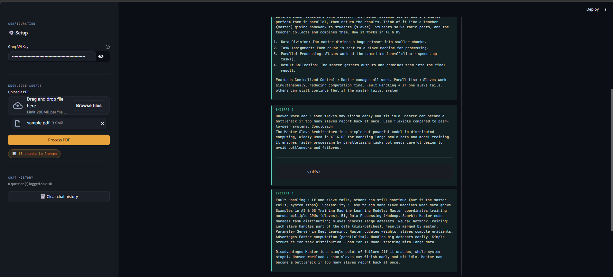
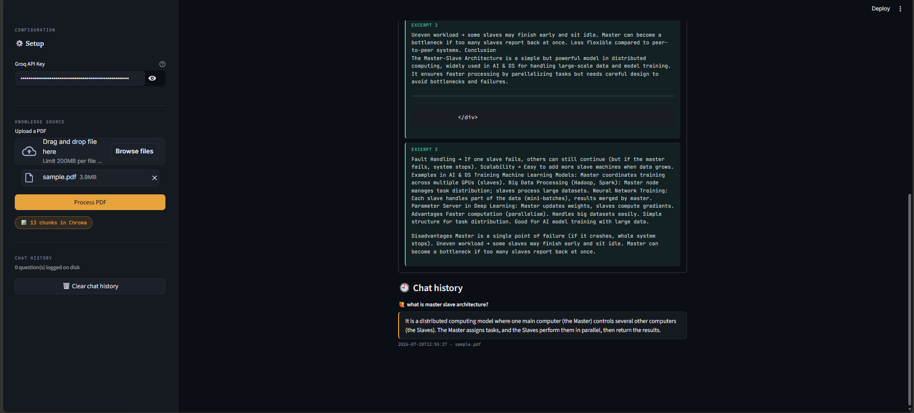

# 📖 DocIntel — PDF Question Answering Agent

A Retrieval-Augmented Generation (RAG) agent that answers natural-language questions about any PDF document, built with **LangGraph** for workflow orchestration, **ChromaDB** for vector search, and **Groq (Llama 3.1)** for fast, free LLM inference — all wrapped in a **Streamlit** web app.


---

## 📑 Table of Contents

- [Overview](#-overview)
- [Demo](#-demo)
- [Screenshots](#-screenshots)
- [Features](#-features)
- [Architecture](#️-architecture)
- [Tech Stack](#️-tech-stack)
- [Project Structure](#-project-structure)
- [Getting Started](#-getting-started)
- [API Keys & Security](#-api-keys--security)
- [How the LangGraph Workflow Works](#-how-the-langgraph-workflow-works)
- [Future Improvements](#️-possible-future-improvements)
- [License](#-license)

---

## 🧭 Overview

Upload any PDF, ask questions about it in plain English, and get accurate, source-grounded answers — with full transparency into exactly which parts of the document the AI used to answer.

This project demonstrates a practical, end-to-end **RAG (Retrieval-Augmented Generation)** pipeline using **LangGraph**, showing how to structure an LLM application as an explicit, inspectable graph rather than a single opaque prompt call.

---

## 🎥 Demo

<!-- Paste the auto-generated link GitHub gives you after dragging LangGraph_demo.mp4
     into the web README editor. It will look like:
     https://github.com/<user>/<repo>/assets/xxxxxxx/xxxxxxxx-xxxx-xxxx-xxxx-xxxxxxxxxxxx.mp4
-->

https://PASTE_VIDEO_LINK_HERE

*(Click to watch the full walkthrough — uploading a PDF, asking questions, and viewing retrieved evidence in action.)*

---

## 🖼️ Screenshots

<table>
  <tr>
    <td width="50%">
      
      <p align="center"><b>Home screen</b> — sidebar setup and empty state</p>
    </td>
    <td width="50%">
      
      <p align="center"><b>Processing a PDF</b> — chunking, embedding, and indexing into ChromaDB</p>
    </td>
  </tr>
  <tr>
    <td width="50%">
      
      <p align="center"><b>Asking a question</b> — the LangGraph workflow retrieves and answers</p>
    </td>
    <td width="50%">
      
      <p align="center"><b>Evidence viewer</b> — inspecting the exact chunks used to generate the answer</p>
    </td>
  </tr>
  <tr>
    <td width="50%" colspan="2">
      
      <p align="center"><b>Persistent chat history</b> — past Q&As survive an app restart</p>
    </td>
  </tr>
</table>

> 📝 If a caption above doesn't match what that screenshot actually shows, just swap the two filenames around, or edit the caption text — no code changes needed.

---

## ✨ Features

- 📄 **Upload any PDF** and have it automatically chunked, embedded, and indexed
- 🔍 **Semantic search** over document content using vector embeddings (not just keyword matching)
- 🤖 **LangGraph-orchestrated workflow** — a clear, auditable `retrieve → generate` pipeline
- 💡 **Grounded answers** — the LLM is instructed to answer only from retrieved content, reducing hallucination
- 🔎 **Evidence viewer** — see the exact document excerpts the model used to generate its answer
- 🕘 **Chat history** — questions and answers persist across app restarts (JSONL log)
- 💾 **Persistent vector store** — re-open the app without re-processing the same PDF
- 🎨 **Custom-designed UI** — polished dark theme, not default Streamlit styling
- 🆓 **100% free stack** — no paid APIs required (Groq + HuggingFace embeddings both have generous free tiers)

---

## 🏗️ Architecture

```
                     ┌─────────────────┐
                     │   User uploads   │
                     │       PDF        │
                     └────────┬─────────┘
                              ▼
                     ┌─────────────────┐
                     │  Extract text    │  (PyPDF)
                     └────────┬─────────┘
                              ▼
                     ┌─────────────────┐
                     │ Split into chunks│  (LangChain text splitter)
                     └────────┬─────────┘
                              ▼
                     ┌─────────────────┐
                     │ Create embeddings│  (HuggingFace all-MiniLM-L6-v2)
                     └────────┬─────────┘
                              ▼
                     ┌─────────────────┐
                     │ Store in ChromaDB│  (persisted to disk)
                     └────────┬─────────┘
                              ▼
                     ┌─────────────────┐
                     │  User asks a     │
                     │    question      │
                     └────────┬─────────┘
                              ▼
        ┌─────────────────────────────────────────┐
        │           LangGraph Workflow             │
        │                                          │
        │   START ──▶ retrieve ──▶ generate ──▶ END│
        │                                          │
        │   retrieve: similarity search in Chroma  │
        │   generate: Groq (Llama 3.1) writes the  │
        │             answer from retrieved context│
        └─────────────────────┬────────────────────┘
                              ▼
                     ┌─────────────────┐
                     │   Answer shown   │
                     │  + saved to log  │
                     └─────────────────┘
```

---

## 🛠️ Tech Stack

| Layer | Tool | Purpose |
|---|---|---|
| Language | Python 3.10+ | Core programming language |
| Workflow orchestration | **LangGraph** | Defines the retrieve → generate pipeline as an explicit graph |
| LLM framework | **LangChain** | Glue between components (splitters, embeddings, message types) |
| PDF parsing | **PyPDF** | Extracts raw text from uploaded PDFs |
| Embeddings | **HuggingFace** (`all-MiniLM-L6-v2`) | Converts text chunks into vectors, runs locally, free |
| Vector database | **ChromaDB** | Stores embeddings and performs similarity search |
| LLM | **Groq** (`llama-3.1-8b-instant`) | Generates the final answer — free tier, very fast inference |
| Web UI | **Streamlit** | Turns the pipeline into an interactive web app |
| Persistence | JSONL file + Chroma's on-disk store | Chat history and vector index survive app restarts |

---

## 📁 Project Structure

```
pdf-qa-langgraph/
├── app.py                  # Main Streamlit application (UI + LangGraph workflow)
├── requirements.txt        # Python dependencies
├── README.md               # This file
├── LICENSE                 # MIT license
├── .gitignore              # Excludes generated data & secrets from git
├── screenshots/            # App screenshots used in this README
│   ├── photo1.png
│   ├── photo2.png
│   ├── photo3.png
│   ├── photo4.png
│   └── photo5.png
└── .streamlit/
    └── config.toml         # Theme configuration (colors, fonts)
```

Generated at runtime (not committed to git — see `.gitignore`):
```
├── chroma_db/               # Persisted vector store (auto-created)
└── chat_history.jsonl       # Persisted Q&A log (auto-created)
```

---

## 🚀 Getting Started

### Prerequisites
- Python 3.10 or higher
- A free [Groq API key](https://console.groq.com)

### 1. Clone the repository
```bash
git clone https://github.com/afrosejamal/langgraph-pdf-qa-agent.git
cd langgraph-pdf-qa-agent
```

### 2. Install dependencies
```bash
pip install -r requirements.txt
```
> First install takes a few minutes — it downloads `torch` and the embedding model (~500MB–1GB).

### 3. Run the app
```bash
streamlit run app.py
```
The app opens automatically at `http://localhost:8501`.

### 4. Use it
1. Paste your Groq API key in the sidebar
2. Upload a PDF and click **Process PDF**
3. Ask questions about the document
4. Expand **"See retrieved evidence"** to inspect exactly what the model read before answering

---

## 🔐 API Keys & Security

This app **never stores your API key** in any file. It's entered through a password-masked field in the UI and held only in memory for the session (`os.environ["GROQ_API_KEY"]`). No `.env` file or hard-coded key exists anywhere in this codebase.

---

## 🧠 How the LangGraph Workflow Works

The core of this project is a two-node graph:

```python
graph = StateGraph(AgentState)
graph.add_node("retrieve", retrieve_node)
graph.add_node("generate", generate_node)
graph.set_entry_point("retrieve")
graph.add_edge("retrieve", "generate")
graph.add_edge("generate", END)
```

- **`retrieve_node`** — takes the user's question, performs a similarity search against the Chroma vector store, and returns the top 3 most relevant chunks
- **`generate_node`** — sends those chunks plus the question to Groq's Llama model with an instruction to answer *only* from the given context, reducing hallucination

Structuring this as an explicit graph (rather than one big prompt) makes the pipeline transparent, debuggable, and easy to extend — for example, adding a "grade the answer / retry" loop, or branching to different retrieval strategies based on question type.

---

## 🗺️ Possible Future Improvements

- [ ] Add a self-correcting loop: grade the generated answer against the context and re-retrieve if it's not well-supported
- [ ] Support multiple PDFs / multi-document knowledge bases
- [ ] Add conversation memory so follow-up questions can reference earlier turns
- [ ] Swap in a hosted vector DB (e.g. Pinecone) for multi-user/production deployment
- [ ] Add authentication for a shared/deployed version

---

## 📄 License

This project is licensed under the MIT License — see the [LICENSE](LICENSE) file for details.

---

## 👤 Author
AFROSE FATHIMA J


**Afrose Jamal**
Feel free to connect or reach out with questions about this project.
